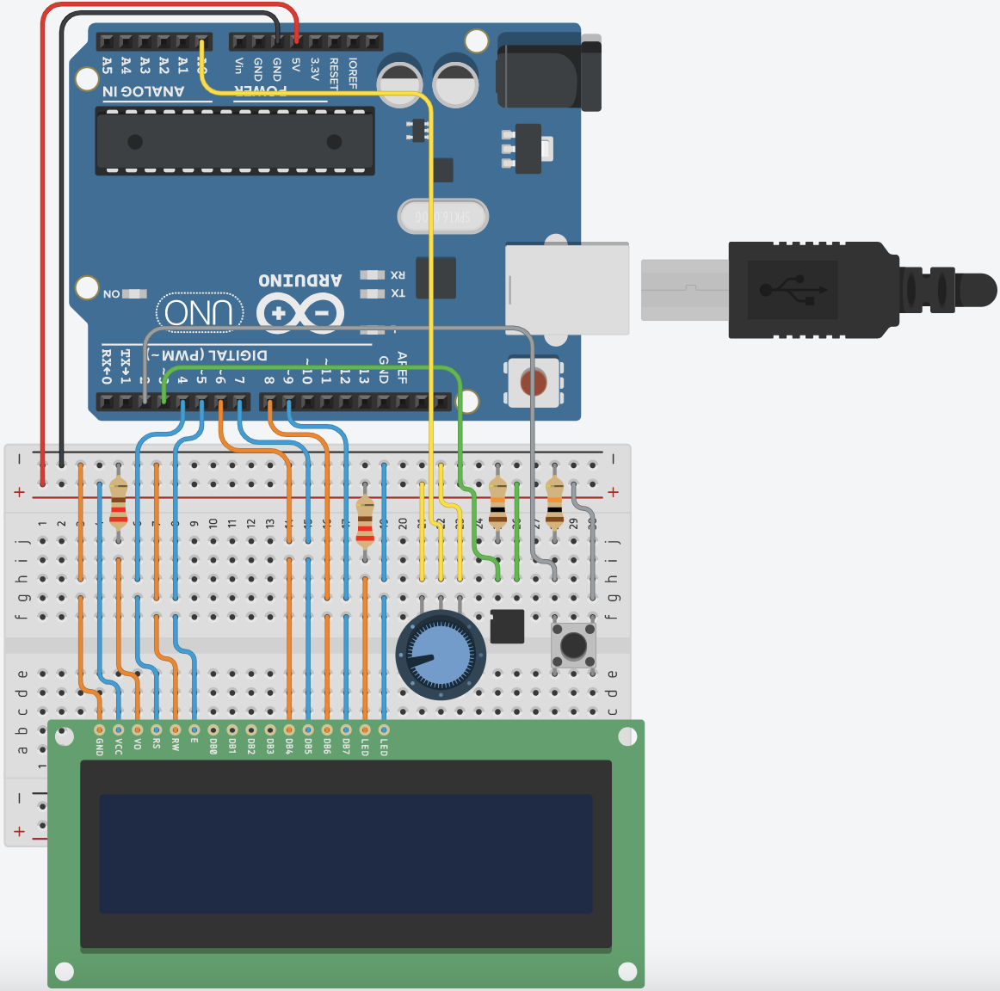
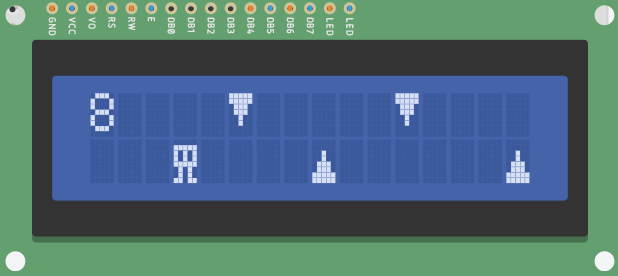
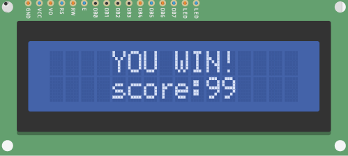
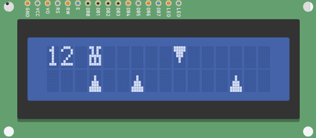
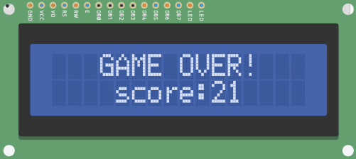

# Arduino Game

This is a relatively simple game that I made using an Arduino Uno. The game is inspired by the Google Chrome dinosaur game (<https://en.wikipedia.org/wiki/Dinosaur_Game>). A replica of the game can be played here: <https://chromedino.com/>.

The game consists of a character and rows of spikes moving towards the player, and the basic premise of the game is to move the character to avoid the spikes. To win the game the player must reach a score of 99. Every time the player avoids a collision with a spike, their score will increase by 1. The game difficulty can be changed at any time during play without needing to start over.

### The Circuit
---


### Run the Game
---
> Note: to run the game, an Arduino Uno is required.

First, clone the repository with:
```
git clone https://github.com/cg-2611/arduino-game.git
```
Next, open the directory created by the `git clone` command:
```
cd arduino-game
```
Finally, open the `ArduinoGame.ino` file in your preferred Arduino development environment, connect your Arduino Uno to your machine, upload the program and run it.

### Controls
---
There are three inputs for the game:
- Button: switches the player from the top row to the bottom row of the LCD display.
- Tilt Sensor: switches the player from the bottom row to the top row of the LCD display.
- Potentiometer: used to control the difficulty of the game, the higher the difficulty, the faster the spikes move.

### Screenshots
---
|                                 Gameplay                                 |                               End Game                               |
|    :----------------------------------------------------------------:    |  :----------------------------------------------------------------:  |
|  |              |
|  |  |